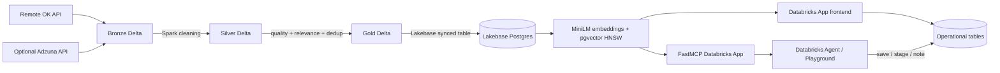

# JobSignal AI Architecture

## Why the architecture is split

- **Delta + Spark** is the data-engineering plane: ingestion, cleaning, deduplication, quality scoring, skill extraction, and curated Gold data.
- **Lakebase** is the low-latency serving and operational plane: synced Gold jobs plus mutable profiles, saves, application stages, notes, contacts, embeddings, and agent-action audit records.
- **pgvector** handles semantic retrieval of unstructured job descriptions.
- **FastMCP** turns retrieval and transactional career actions into standardized tools for an AI agent.

This division makes each required capstone technology solve a real problem instead of existing only to satisfy a checkbox.
