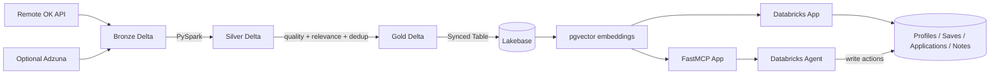

# JobSignal AI

**Trust-Aware Data & AI Job Hunting Copilot built on Databricks**

JobSignal AI turns noisy third-party job feeds into a curated Data/AI opportunity layer, performs semantic matching against a candidate profile, and gives an AI agent tools that can both retrieve opportunities and persist real actions such as saving a job, moving an application stage, and recording interview notes.

The project is designed as the capstone for DataExpert.io's **The Rise of the AI Data Engineer** bootcamp.

## Capstone requirement coverage

| Requirement | JobSignal AI implementation |
|---|---|
| Spark data pipeline | PySpark Bronze → Silver → Gold in `pipelines/jobs_spark_pipeline.py` |
| Third-party API | Remote OK JSON API (required); Adzuna optional |
| Unstructured data | HTML/free-text job descriptions cleaned, chunked and embedded |
| Databricks App frontend | Flask dashboard in `app.py` + `templates/` + `static/` |
| AI agent that reads and writes | FastMCP server with semantic search plus persistent Lakebase actions |

## Why this is more than a job-board demo

Public job feeds are not automatically clean enough for a trustworthy agent. JobSignal therefore treats job discovery as a data-engineering problem first:

1. **Bronze** preserves normalized source records and ingestion metadata.
2. **Silver** cleans text, detects weak/placeholder records, extracts skills, scores quality and relevance, and deduplicates opportunities.
3. **Gold** keeps trusted Data/AI roles only.
4. Gold is served at low latency through a **Lakebase synced table**.
5. Job descriptions are embedded with `sentence-transformers/all-MiniLM-L6-v2` into Lakebase `VECTOR(384)` rows with an HNSW cosine index.
6. Search uses an explainable hybrid score: **semantic similarity + candidate skill overlap + source quality**.
7. The same Lakebase database stores mutable operational state: profile, skills, saves, applications, notes, contacts, and agent action logs.
8. A dedicated **FastMCP Databricks App** exposes retrieval and write tools to the agent.

## Architecture



See `ARCHITECTURE.md` for the design rationale.

## Repository layout

```text
.
├── app.py                         # Databricks App REST API + frontend
├── app.yaml                       # frontend runtime configuration
├── lakebase.py                    # OAuth Postgres + operational schema
├── embeddings.py                  # MiniLM chunk/embedding pipeline
├── matching.py                    # explainable hybrid match score
├── job_sources/
│   ├── remoteok_client.py         # required keyless third-party source
│   └── adzuna_client.py           # optional second source
├── pipelines/
│   └── jobs_spark_pipeline.py     # Bronze/Silver/Gold PySpark pipeline
├── scripts/
│   ├── create_synced_table.py     # Gold Delta → Lakebase serving
│   ├── embed_jobs.py
│   └── seed_demo_profile.py
├── mcp_server/
│   ├── app.py                     # stateless FastMCP server
│   ├── job_broker.py              # DB + matching adapter
│   ├── app.yaml
│   └── requirements.txt
├── agent/
│   ├── SYSTEM_PROMPT.md
│   └── AGENT_CONFIG.md
├── sql/01_operational_schema.sql
├── templates/index.html
├── static/app.css
├── static/app.js
├── tests/
└── evidence/
```

## Data source and attribution

The required source is **Remote OK**, selected because it provides a live JSON job feed without an API key, which keeps the required end-to-end path reproducible. The frontend visibly links back to Remote OK wherever its API data is used. Adzuna is implemented only as an optional multi-source extension so API credentials and quotas cannot block the capstone.

## Spark transformation design

`pipelines/jobs_spark_pipeline.py` produces three Delta tables in the `jobsignal_capstone` schema of the current Unity Catalog catalog by default:

- `bronze_jobs`
- `silver_jobs`
- `gold_jobs`

Silver adds:

- `quality_score` (0–100)
- `quality_flags`
- `relevance_score` (0–100)
- `extracted_skills`
- `dedup_key`
- `is_high_quality`
- `is_data_ai_role`

Gold requires `quality_score >= 65` and `relevance_score >= 55` and is deduplicated by normalized company/title/location.

## Lakebase design

The Gold table is intentionally read-only application data. It is synced to Lakebase for serving. Mutable user/agent state stays in the `jobsignal_app` Postgres schema:

- `profiles`
- `skills`
- `job_embeddings`
- `saved_jobs`
- `applications`
- `interview_notes`
- `contacts`
- `agent_action_log`

`job_embeddings.embedding` is `VECTOR(384)` and has an HNSW `vector_cosine_ops` index.

## Matching formula

When a profile has skills:

```text
match = 65% semantic similarity
      + 25% extracted-skill overlap
      + 10% job data-quality score
```

The app returns `matched_skills`, `missing_skills`, `similarity`, `quality_score`, and final `match_score` instead of hiding the ranking behind an opaque LLM decision.

## MCP tools

The MCP App exposes:

- `search_matching_jobs` — semantic + skill + quality ranking
- `get_job_details` — authoritative source record
- `save_job` — writes a bookmark to Lakebase
- `move_application` — creates/updates a local pipeline stage
- `add_interview_note` — persists notes
- `get_stale_applications` — finds applications needing follow-up

The system prompt explicitly forbids the agent from claiming it submitted an external application. `applied` means **the local tracker was updated after the user says they applied**.

# Deployment — fastest reliable path

## 1. Run the Spark pipeline

Create a Databricks Git Folder for this repository and run:

```text
pipelines/jobs_spark_pipeline.py
```

Expected final output contains:

```text
bronze_rows
silver_rows
gold_rows
rejected_or_non_target
gold_table
```

Capture that output as evidence.

## 2. Sync Gold into Lakebase

Set these environment variables in a notebook/script execution context:

```text
JOBSIGNAL_SOURCE_TABLE=<catalog>.jobsignal_capstone.gold_jobs
JOBSIGNAL_SYNCED_TABLE_ID=<catalog>.jobsignal_capstone.gold_jobs_synced
LAKEBASE_BRANCH=projects/dataexpert-support-app/branches/production
PGDATABASE=databricks_postgres
```

Then run:

```bash
python scripts/create_synced_table.py
```

The destination Postgres table is expected as:

```text
jobsignal_capstone.gold_jobs_synced
```

For this capstone, `SNAPSHOT` is used for the initial reliable demo. A production extension can change the sync policy to `TRIGGERED` or `CONTINUOUS`.

## 3. Deploy the frontend Databricks App

Create a Databricks App, for example:

```text
jobsignal-ai
```

Attach the existing Lakebase project/branch as a Database resource. Deploy from the **repository root**, which contains `app.py`, `app.yaml`, and `requirements.txt`.

The checked-in `app.yaml` currently targets:

```text
projects/dataexpert-support-app/branches/production/endpoints/primary
```

and expects:

```text
JOB_POSTINGS_TABLE=jobsignal_capstone.gold_jobs_synced
JOBSIGNAL_SCHEMA=jobsignal_app
```

## 4. Seed profile and embed jobs

From the deployed UI:

1. Click **Load demo Data Engineer profile**.
2. Click **Embed new Gold jobs**.
3. Search for a role such as:

```text
remote data engineering roles using Python SQL Spark and Databricks
```

Or run the scripts directly:

```bash
python scripts/seed_demo_profile.py
python scripts/embed_jobs.py
```

## 5. Deploy the MCP App

Create a second Databricks App whose name starts with `mcp-`, for example:

```text
mcp-jobsignal-ai
```

Deploy using `mcp_server/` as the source folder. Attach the **same Lakebase branch**. The server is stateless HTTP and exposes MCP at:

```text
https://<mcp-app-url>/mcp
```

## 6. Configure the agent

Use `agent/SYSTEM_PROMPT.md` as the agent instructions and add the deployed `mcp-jobsignal-ai` server as its external MCP tool.

Recommended demonstrations are in `agent/AGENT_CONFIG.md`.

At minimum capture:

1. search/rank jobs,
2. save a job (write),
3. update the application tracker (write).

## Testing

The local unit tests cover deterministic logic that does not require Databricks credentials:

```bash
pytest -q
```

Before submission also complete the integration evidence in `evidence/README.md`.

## Security

- No Lakebase passwords are committed.
- Databricks Apps generate short-lived database OAuth credentials with `WorkspaceClient().postgres.generate_database_credential(...)`.
- Optional Adzuna credentials come from environment variables / Databricks secrets.
- `.env` is gitignored.
- Screenshots must not contain tokens or client secrets.

## Known limitations / next improvements

- The required demo source is Remote OK, so job coverage is intentionally narrower than a commercial aggregator. Adzuna is ready as an optional second source.
- Skill extraction is deterministic and explainable; an advanced version could evaluate a richer skill ontology.
- Embeddings are generated in the application path for a compact capstone. At larger scale, embedding creation would move to a scheduled batch/model-serving workflow.
- JobSignal tracks application state but does not automate job submissions, avoiding brittle or misleading external actions.

## Submission

Repository: `https://github.com/PedroD1265/jobsignal-ai-databricks-capstone`.

Use `SUBMISSION_CHECKLIST.md` before producing the final ZIP. `SUBMISSION.md` has placeholders only for the Databricks App URLs until deployment is complete.
